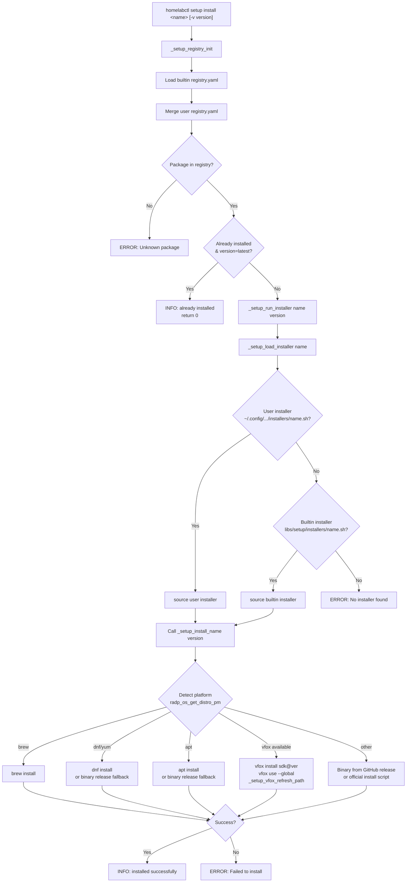

# CLAUDE.md

This file provides guidance to Claude Code (claude.ai/code) when working with code in this repository.

## Project Overview

homelabctl is a CLI tool for managing homelab infrastructure, built on top of radp-bash-framework. It provides a unified interface for orchestrating various homelab components, starting with radp-vagrant-framework integration.

## Commands

### Running homelabctl
```bash
# Ensure radp-bash-framework is in PATH
export PATH="/path/to/radp-bash-framework/src/main/shell/bin:$PATH"

# Set radp-vagrant-framework home (for vf commands)
export RADP_VF_HOME="/path/to/radp-vagrant-framework"

./bin/homelabctl --help
./bin/homelabctl vf info
./bin/homelabctl vg up
```

### Available Commands
- `vg <cmd>` - Vagrant command passthrough (sets VAGRANT_VAGRANTFILE automatically)
- `vf init` - Initialize a vagrant project (supports -t/--template, --set options)
- `vf info` - Show environment information (versions, paths, plugins)
- `vf list` - List clusters and guests (supports -v, --provisions, --synced-folders, --triggers)
- `vf validate` - Validate YAML configuration files
- `vf dump-config` - Export merged configuration (JSON/YAML, supports -f and -o options)
- `vf generate` - Generate standalone Vagrantfile
- `vf template list` - List available project templates
- `vf template show` - Show template details and variables
- `vf version` - Show radp-vagrant-framework version
- `setup install <name>` - Install a software package (-v version, --dry-run)
- `setup list` - List available packages (-c category, --installed, --categories)
- `setup info <name>` - Show package details
- `setup profile list` - List available setup profiles
- `setup profile show <name>` - Show profile details
- `setup profile apply <name>` - Apply a profile (--dry-run, --continue, --skip-installed)
- `setup configure list` - List available system configurations
- `setup configure chrony` - Configure chrony time synchronization
- `setup configure expand-lvm` - Expand LVM partition and filesystem
- `setup configure gpg-import` - Import GPG keys into user keyring
- `setup configure gpg-preset` - Preset GPG passphrase in gpg-agent
- `setup configure yadm` - Clone dotfiles repository using yadm
- `version` - Show homelabctl version
- `completion <bash|zsh>` - Generate shell completion

## Architecture

### Directory Structure
```
homelabctl/
├── bin/
│   └── homelabctl              # CLI entry point
├── completions/
│   ├── homelabctl.bash         # Bash completion script
│   └── homelabctl.zsh          # Zsh completion script
├── src/main/shell/
│   ├── commands/               # Command implementations
│   │   ├── vg.sh               # homelabctl vg <cmd>
│   │   ├── vf/                 # homelabctl vf <subcommand>
│   │   │   ├── init.sh
│   │   │   ├── info.sh
│   │   │   ├── list.sh
│   │   │   ├── validate.sh
│   │   │   ├── dump-config.sh
│   │   │   ├── generate.sh
│   │   │   ├── template/       # homelabctl vf template <subcommand>
│   │   │   │   ├── list.sh
│   │   │   │   └── show.sh
│   │   │   └── version.sh
│   │   ├── setup/              # homelabctl setup <subcommand>
│   │   │   ├── install.sh
│   │   │   ├── list.sh
│   │   │   ├── info.sh
│   │   │   ├── profile/        # homelabctl setup profile <subcommand>
│   │   │   │   ├── list.sh
│   │   │   │   ├── show.sh
│   │   │   │   └── apply.sh
│   │   │   └── configure/      # homelabctl setup configure <subcommand>
│   │   │       ├── list.sh     # Dynamic list from @desc annotations
│   │   │       ├── chrony.sh
│   │   │       ├── expand-lvm.sh
│   │   │       ├── gpg-import.sh
│   │   │       ├── gpg-preset.sh
│   │   │       └── yadm.sh
│   │   ├── version.sh
│   │   └── completion.sh
│   ├── config/
│   │   └── config.yaml         # YAML configuration
│   ├── vars/
│   │   └── constants.sh        # Version constants (gr_homelabctl_version)
│   └── libs/                   # Project-specific libraries
│       └── setup/              # Setup feature libraries
│           ├── _common.sh      # Shared helper functions
│           ├── registry.sh     # Registry management
│           ├── installer.sh    # Installer utilities
│           ├── registry.yaml   # Package registry
│           ├── profiles/       # Profile definitions
│           │   └── recommend.yaml
│           └── installers/     # Package installers (43 files)
│               ├── ansible.sh
│               ├── bat.sh
│               ├── docker.sh
│               ├── eza.sh
│               ├── fastfetch.sh
│               ├── fd.sh
│               ├── fzf.sh
│               ├── git-credential-manager.sh
│               ├── git.sh
│               ├── gitlab-runner.sh
│               ├── gnu-getopt.sh
│               ├── go.sh
│               ├── gpg.sh
│               ├── helm.sh
│               ├── homebrew.sh
│               ├── jdk.sh
│               ├── jq.sh
│               ├── kubecm.sh
│               ├── kubectl.sh
│               ├── lazygit.sh
│               ├── markdownlint-cli.sh
│               ├── mc.sh
│               ├── mvn.sh
│               ├── neovim.sh
│               ├── nodejs.sh
│               ├── ohmyzsh.sh
│               ├── pass.sh
│               ├── pinentry.sh
│               ├── python.sh
│               ├── ripgrep.sh
│               ├── ruby.sh
│               ├── rust.sh
│               ├── shellcheck.sh
│               ├── starship.sh
│               ├── terraform.sh
│               ├── tig.sh
│               ├── tmux.sh
│               ├── vagrant.sh
│               ├── vfox.sh
│               ├── vim.sh
│               ├── yadm.sh
│               ├── zoxide.sh
│               └── zsh.sh
├── packaging/
│   ├── copr/
│   │   └── homelabctl.spec     # RPM spec for COPR
│   ├── homebrew/
│   │   └── homelabctl.rb       # Homebrew formula template
│   └── obs/
│       ├── homelabctl.spec     # RPM spec for OBS
│       └── debian/             # Debian packaging files
├── install.sh                  # Universal installer script
└── .github/workflows/          # CI/CD workflows
```

### Version Management

Version is stored in `src/main/shell/vars/constants.sh`:
```bash
declare -gr gr_homelabctl_version=v0.1.0
```

This is the single source of truth for release management.

### Command Definition Pattern
Commands are defined using comment-based metadata:
```bash
# @cmd
# @desc Command description
# @arg name! Required argument
# @arg opts~ Variadic arguments
# @option -e, --env <name> Environment name
# @example vf init -d ~/lab

cmd_vf_init() {
    # Access options via opt_* variables
    local dir="${opt_dir:-.}"
    # Implementation...
}
```

### Naming Conventions
- Command files: `commands/<cmd>.sh` or `commands/<group>/<subcmd>.sh`
- Command functions: `cmd_<name>()` or `cmd_<group>_<subcmd>()`
- Options accessed via: `$opt_<long_name>` (dashes converted to underscores)

## CI/CD

### Release Process
1. Trigger `release-prep` workflow with bump_type (patch/minor/major/manual)
2. Review/merge the generated PR
3. `create-version-tag` auto-creates and pushes the tag
4. `update-spec-version` syncs spec files
5. `build-copr-package` and `build-obs-package` build the packages
6. `update-homebrew-tap` updates the Homebrew formula
7. `attach-release-packages` uploads built packages to GitHub Release

### Required Secrets
- `COPR_LOGIN`, `COPR_TOKEN`, `COPR_USERNAME`, `COPR_PROJECT` - COPR access
- `OBS_USERNAME`, `OBS_PASSWORD`, `OBS_PROJECT`, `OBS_PACKAGE` - OBS access
- `HOMEBREW_TAP_TOKEN` - GitHub token for homebrew-radp repository

## Dependencies
- radp-bash-framework (required) - CLI framework
- radp-vagrant-framework (for vf commands) - set `RADP_VF_HOME` env var
- vagrant (for vg commands) - Vagrant CLI

## Environment Variables
- `RADP_VF_HOME` - Path to radp-vagrant-framework (required for vf commands)
- `RADP_VAGRANT_CONFIG_DIR` - Override config directory (default: ./config)
- `RADP_VAGRANT_ENV` - Override environment name

## Setup Feature

The setup command manages software installation across different platforms.

### Architecture

The setup install system is composed of four layers:

```
commands/setup/install.sh        Entry point (cmd_setup_install)
        |
libs/setup/registry.sh           Package metadata (name, desc, category, check-cmd)
libs/setup/registry.yaml          + user ~/.config/homelabctl/setup/registry.yaml
        |
libs/setup/installer.sh          Loader & runner (_setup_run_installer)
        |
libs/setup/installers/<name>.sh  Per-package install logic (_setup_install_<name>)
libs/setup/_common.sh            Shared helpers (arch/os detection, vfox PATH refresh)
```

**Key source files:**

| File | Role |
|------|------|
| `commands/setup/install.sh` | CLI entry: parse args, check registry, call `_setup_run_installer` |
| `libs/setup/registry.sh` | Load & query `registry.yaml` (builtin + user merge) |
| `libs/setup/installer.sh` | `_setup_load_installer` (source `.sh`), `_setup_run_installer` (call function), `_setup_install_binary` (copy binary to `/usr/local/bin`) |
| `libs/setup/_common.sh` | `_setup_is_installed`, `_setup_get_arch`, `_setup_get_os`, `_setup_vfox_refresh_path` |
| `libs/setup/installers/*.sh` | Each file exports `_setup_install_<name>(version)` |

### Install Flow



### Installer Design Patterns

Each installer (`libs/setup/installers/<name>.sh`) follows a consistent pattern:

```bash
_setup_install_<name>() {
  local version="${1:-latest}"

  # 1. Early return if already installed
  if _setup_is_installed <cmd> && [[ "$version" == "latest" ]]; then
    radp_log_info "<name> is already installed"
    return 0
  fi

  # 2. Detect platform
  local pm
  pm=$(radp_os_get_distro_pm 2>/dev/null || echo "unknown")

  # 3. Platform-specific install strategy
  case "$pm" in
  brew)     ... ;;           # macOS: Homebrew
  dnf|yum)  ... ;;           # RHEL/CentOS: native PM, fallback to binary
  apt)      ... ;;           # Debian/Ubuntu: native PM, fallback to binary
  *)        ... ;;           # Fallback: GitHub release binary or official script
  esac
}
```

**Install strategy priority:**

1. **Version manager** (vfox) -- for language runtimes (nodejs, jdk, ruby, go, python). After vfox install, calls `_setup_vfox_refresh_path` to inject `~/.version-fox/sdks/*/bin` into current shell PATH via `eval "$(vfox env -s bash)"`, ensuring subsequent installers can find the tools (e.g., markdownlint-cli needs npm from nodejs).
2. **Native package manager** -- brew on macOS, dnf/apt on Linux
3. **Binary release fallback** -- download from GitHub Releases / official CDN
4. **Source build** -- last resort for tools without pre-built binaries (tig, tmux, pass, git, zsh)

**User extension:** Users can override any builtin installer by placing `<name>.sh` in `~/.config/homelabctl/setup/installers/`. User installers are loaded with higher priority than builtin ones.

### Usage Examples
```bash
# List available packages
homelabctl setup list
homelabctl setup list -c search
homelabctl setup list --installed

# Show package info
homelabctl setup info fzf

# Install packages
homelabctl setup install fzf
homelabctl setup install nodejs -v 20.10.0
homelabctl setup install jdk -v 17

# Profiles
homelabctl setup profile list
homelabctl setup profile show recommend
homelabctl setup profile apply recommend --dry-run
homelabctl setup profile apply recommend --continue
```

### User Extensions

Users can extend the setup feature by adding custom packages and profiles in `~/.config/homelabctl/setup/`:

```
~/.config/homelabctl/setup/
├── registry.yaml           # Custom package definitions
├── profiles/               # Custom profiles
│   └── my-profile.yaml
└── installers/             # Custom installers
    └── my-tool.sh
```

User files take precedence over builtin files.

### Adding a Custom Package

1. Define the package in `~/.config/homelabctl/setup/registry.yaml`:
```yaml
packages:
  my-tool:
    desc: My custom tool
    category: utilities
    check-cmd: my-tool
```

2. Create installer at `~/.config/homelabctl/setup/installers/my-tool.sh`:
```bash
#!/usr/bin/env bash
_setup_install_my_tool() {
    local version="${1:-latest}"
    # Installation logic here
}
```

### Adding a Custom Profile

Create `~/.config/homelabctl/setup/profiles/my-profile.yaml`:
```yaml
name: my-profile
desc: My custom profile
platform: any

packages:
  - name: fzf
  - name: bat
  - name: my-tool
    version: "1.0.0"
```

## Configure Feature

The `setup configure` command group provides ready-to-use system configuration tasks.

### Available Configurations

| Command | Description |
|---------|-------------|
| `chrony` | Configure chrony for NTP time synchronization |
| `expand-lvm` | Expand LVM partition and filesystem to use all disk space |
| `gpg-import` | Import GPG keys from file, content, or keyserver |
| `gpg-preset` | Preset GPG passphrase in gpg-agent for non-interactive operations |
| `yadm` | Clone dotfiles repository using yadm |

### Architecture

Configure commands are auto-discovered from `commands/setup/configure/`:

```
commands/setup/configure/
├── list.sh          # Dynamic list (scans @desc from other files)
├── chrony.sh        # homelabctl setup configure chrony
├── expand-lvm.sh    # homelabctl setup configure expand-lvm
├── gpg-import.sh    # homelabctl setup configure gpg-import
├── gpg-preset.sh    # homelabctl setup configure gpg-preset
└── yadm.sh          # homelabctl setup configure yadm
```

### Command Pattern

All configure commands follow a consistent pattern using framework's dry-run support:

```bash
cmd_setup_configure_example() {
  # Set dry-run mode from flag
  radp_set_dry_run "${opt_dry_run:-}"

  # Use radp_exec for commands that need sudo
  radp_exec_sudo "Install package" apt-get install -y package

  # Use radp_dry_run_skip for complex operations
  if radp_dry_run_skip "Configure complex settings"; then
    return 0
  fi
  # ... actual implementation ...
}
```

### Usage Examples

```bash
# List available configurations
homelabctl setup configure list

# Configure time synchronization
homelabctl setup configure chrony --servers "ntp.aliyun.com" --timezone "Asia/Shanghai"
homelabctl setup configure chrony --dry-run

# Expand LVM (auto-detects configuration)
homelabctl setup configure expand-lvm
homelabctl setup configure expand-lvm --partition /dev/sda3 --vg ubuntu-vg --lv ubuntu-lv

# Import GPG keys
homelabctl setup configure gpg-import --secret-key-file ~/.secrets/key.asc --passphrase-file ~/.secrets/pass.txt
homelabctl setup configure gpg-import --key-id 0x1234567890ABCDEF --keyserver keys.openpgp.org

# Preset GPG passphrase for automation
homelabctl setup configure gpg-preset --key-uid "user@example.com" --passphrase-file ~/.secrets/pass.txt

# Clone dotfiles with yadm
homelabctl setup configure yadm --repo-url "git@github.com:user/dotfiles.git" --ssh-key-file ~/.ssh/id_rsa --bootstrap
```

### Notes

- All commands support `--dry-run` to preview changes
- Commands use `sudo` for privileged operations (no need to run as root)
- `--user` option allows configuring for another user (requires sudo)
