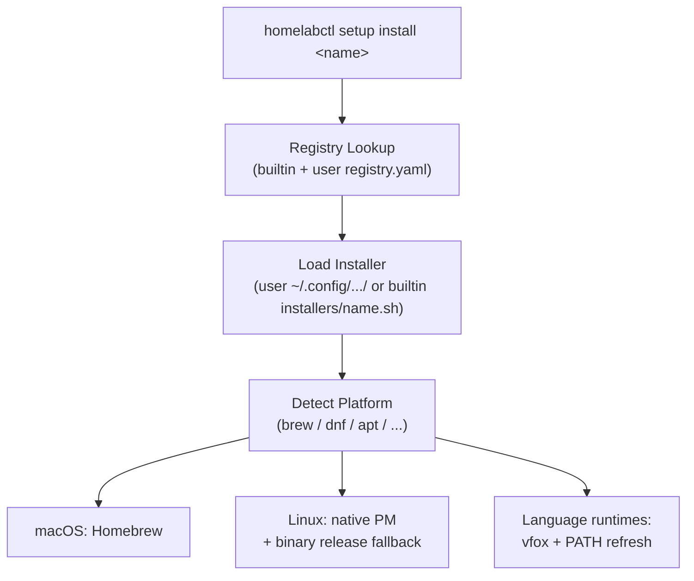

# homelabctl

```
    __                         __      __         __  __
   / /_  ____  ____ ___  ___  / /___ _/ /_  _____/ /_/ /
  / __ \/ __ \/ __ `__ \/ _ \/ / __ `/ __ \/ ___/ __/ /
 / / / / /_/ / / / / / /  __/ / /_/ / /_/ / /__/ /_/ /
/_/ /_/\____/_/ /_/ /_/\___/_/\__,_/_.___/\___/\__/_/


```

[](https://copr.fedorainfracloud.org/coprs/xooooooooox/radp/package/radp-bash-framework/)
[](https://build.opensuse.org/package/show/home:xooooooooox:radp/radp-bash-framework)
[](https://github.com/xooooooooox/radp-bash-framework/actions/workflows/build-copr-package.yml)
[](https://github.com/xooooooooox/radp-bash-framework/actions/workflows/build-obs-package.yml)
[](https://github.com/xooooooooox/radp-bash-framework/actions/workflows/update-homebrew-tap.yml)

[](https://download.copr.fedorainfracloud.org/results/xooooooooox/radp/)
[](https://software.opensuse.org//download.html?project=home%3Axooooooooox%3Aradp&package=radp-bash-framework)

A CLI tool for managing homelab infrastructure, built
on [radp-bash-framework](https://github.com/xooooooooox/radp-bash-framework).

## Features

- **Vagrant Integration** - Passthrough to Vagrant commands with automatic Vagrantfile detection
- **RADP Vagrant Framework** - Initialize, configure, and manage multi-VM environments
- **Software Setup** - Install CLI tools, languages, and DevOps tools across platforms with profiles
- **Shell Completion** - Bash and Zsh completion with dynamic package/profile suggestions

## Installation

### Quick Install

```shell
curl -fsSL https://raw.githubusercontent.com/xooooooooox/homelabctl/main/install.sh | bash
```

The install script automatically installs dependencies, homelabctl, and configures shell completion.

### Homebrew (macOS)

```shell
brew tap xooooooooox/radp
brew install homelabctl
```

### RPM (Fedora/RHEL/CentOS)

```shell
sudo dnf copr enable -y xooooooooox/radp
sudo dnf install -y radp-bash-framework homelabctl
```

See [Installation Guide](docs/installation.md) for more options.

## Quick Start

```shell
# Show help
homelabctl --help

# Install development tools
homelabctl setup install fzf
homelabctl setup profile apply recommend

# Manage Vagrant VMs
homelabctl vf init myproject --template k8s-cluster
homelabctl vg up
```

## Commands

### Vagrant Integration (vg, vf)

Manage Vagrant virtual machines with automatic Vagrantfile detection and multi-VM configuration.

| Command            | Description                     |
|--------------------|---------------------------------|
| `vg <cmd>`         | Vagrant command passthrough     |
| `vf init [dir]`    | Initialize a vagrant project    |
| `vf list`          | List clusters and guests        |
| `vf info`          | Show environment information    |
| `vf validate`      | Validate YAML configuration     |
| `vf dump-config`   | Export merged configuration     |
| `vf generate`      | Generate standalone Vagrantfile |
| `vf template list` | List available templates        |
| `vf template show` | Show template details           |
| `vf version`       | Show framework version          |

**Examples:**

```shell
# Vagrant passthrough
homelabctl vg up
homelabctl vg ssh
homelabctl vg status

# Initialize project from template
homelabctl vf init myproject
homelabctl vf init myproject --template k8s-cluster

# View configuration
homelabctl vf list
homelabctl vf info
homelabctl vf dump-config -f yaml
```

**Environment Variables:**

| Variable                  | Description                                        |
|---------------------------|----------------------------------------------------|
| `RADP_VF_HOME`            | Path to radp-vagrant-framework installation        |
| `RADP_VAGRANT_CONFIG_DIR` | Configuration directory path (default: `./config`) |
| `RADP_VAGRANT_ENV`        | Override environment name                          |

For VM configuration details,
see [radp-vagrant-framework Configuration Reference](https://github.com/xooooooooox/radp-vagrant-framework/blob/main/docs/configuration-reference.md).

### Software Setup (setup)

Install and manage software packages across different platforms. Supports individual package installation and batch
installation via profiles.

| Command                      | Description                           |
|------------------------------|---------------------------------------|
| `setup list`                 | List available packages               |
| `setup info <name>`          | Show package details                  |
| `setup deps <name>`          | Show package dependency tree          |
| `setup install <name>`       | Install a package                     |
| `setup profile list`         | List available profiles               |
| `setup profile show <name>`  | Show profile details                  |
| `setup profile apply <name>` | Apply a profile                       |
| `setup configure list`       | List available system configurations  |
| `setup configure chrony`     | Configure chrony time synchronization |
| `setup configure expand-lvm` | Expand LVM partition and filesystem   |
| `setup configure gpg-import` | Import GPG keys into user keyring     |
| `setup configure gpg-preset` | Preset GPG passphrase in gpg-agent    |
| `setup configure yadm`       | Clone dotfiles repository using yadm  |

**Examples:**

```shell
# List and search packages
homelabctl setup list
homelabctl setup list -c cli-tools
homelabctl setup list --installed

# Show package info and dependencies
homelabctl setup info git-credential-manager
homelabctl setup info git-credential-manager --all-platforms
homelabctl setup deps markdownlint-cli
homelabctl setup deps nodejs --reverse

# Install packages
homelabctl setup install fzf
homelabctl setup install nodejs -v 20
homelabctl setup install jdk -v 17

# Work with profiles
homelabctl setup profile list
homelabctl setup profile show recommend
homelabctl setup profile apply recommend --dry-run
homelabctl setup profile apply recommend --continue

# System configuration
homelabctl setup configure list
homelabctl setup configure chrony --servers "ntp.aliyun.com" --timezone "Asia/Shanghai"
homelabctl setup configure expand-lvm
homelabctl setup configure gpg-import --secret-key-file ~/.secrets/key.asc --passphrase-file ~/.secrets/pass.txt
homelabctl setup configure gpg-preset --key-uid "user@example.com" --passphrase-file ~/.secrets/pass.txt
homelabctl setup configure yadm --repo-url "git@github.com:user/dotfiles.git" --ssh-key-file ~/.ssh/id_rsa --bootstrap
```

**How It Works:**



The install system uses a layered architecture: a **registry** (`registry.yaml`) defines available packages and
metadata, an **installer loader** (`installer.sh`) dynamically sources per-package scripts, and each **installer** (
`installers/<name>.sh`) implements platform-specific install strategies. Users can extend both the registry and
installers via `~/.config/homelabctl/setup/`.

For language runtimes (nodejs, jdk, ruby, go, python), [vfox](https://github.com/version-fox/vfox) is preferred when
available. After a vfox-based install, the current shell PATH is refreshed via `vfox env` so that dependent tools (e.g.,
markdownlint-cli needs npm) can be installed in the same session.

**Available Categories:**

- **system** - System prerequisites (homebrew, gnu-getopt)
- **shell** - Shell and terminal (zsh, tmux, ohmyzsh, starship, zoxide)
- **editors** - Text editors (vim, neovim)
- **languages** - Programming languages (nodejs, jdk, python, go, rust, ruby, vfox, mvn)
- **devops** - DevOps tools (kubectl, helm, kubecm, vagrant, docker, terraform, ansible)
- **vcs** - Version control (git, lazygit, tig, git-credential-manager, yadm)
- **security** - Security tools (gpg, pinentry, pass)
- **search** - Search utilities (fzf, fd, ripgrep, bat, eza)
- **dev-tools** - Development tools (jq, shellcheck, markdownlint-cli)
- **utilities** - System utilities (mc, fastfetch)

**Built-in Profiles:**

| Profile     | Description                                         |
|-------------|-----------------------------------------------------|
| `recommend` | Recommended development environment with essentials |

**System Configuration:**

The `setup configure` commands provide ready-to-use system configuration tasks:

| Command      | Description                                                      |
|--------------|------------------------------------------------------------------|
| `chrony`     | Configure NTP time synchronization with custom servers           |
| `expand-lvm` | Expand LVM partition/filesystem to use all available disk space  |
| `gpg-import` | Import GPG keys from file, content, or keyserver                 |
| `gpg-preset` | Cache GPG passphrase in gpg-agent for non-interactive operations |
| `yadm`       | Clone dotfiles repository with SSH/HTTPS, bootstrap, decrypt     |

All configure commands support `--dry-run` to preview changes. Run `homelabctl setup configure <name> --help` for
detailed options.

**User Extensions:**

Add custom packages and profiles in `~/.config/homelabctl/setup/`:

```
~/.config/homelabctl/setup/
├── registry.yaml      # Custom package definitions
├── profiles/          # Custom profiles
│   └── my-profile.yaml
└── installers/        # Custom installers
    └── my-tool.sh
```

User files take precedence over builtin files when names conflict.

**Adding a Custom Package:**

1. Define in `~/.config/homelabctl/setup/registry.yaml`:

```yaml
packages:
  my-tool:
    desc: "My custom tool"
    category: utilities
    check-cmd: my-tool         # Command to verify installation
    homepage: https://example.com
    requires: git              # Dependencies (auto-installed)
    recommends: fzf            # Optional recommendations (shown as hint)
    platform: # Platform-specific dependencies
      linux:
        recommends: pass gpg
      linux-arm64: # OS-arch specific (higher priority than OS-only)
        requires: dotnet-sdk
        recommends: pass gpg
```

Platform keys support both OS-only (`linux`, `darwin`) and OS-arch combinations (`linux-arm64`, `darwin-amd64`). The
lookup chain is: `os-arch` → `os` → base.

2. Create installer at `~/.config/homelabctl/setup/installers/my-tool.sh`:

```bash
#!/usr/bin/env bash
_setup_install_my_tool() {
  local version="${1:-latest}"
  local pm
  pm=$(radp_os_get_distro_pm 2>/dev/null || echo "unknown")

  case "$pm" in
  brew) brew install my-tool ;;
  dnf) sudo dnf install -y my-tool ;;
  apt) sudo apt-get install -y my-tool ;;
  *)
    radp_log_error "Unsupported platform";
    return 1
    ;;
  esac
}
```

**Adding a Custom Profile:**

Create `~/.config/homelabctl/setup/profiles/my-profile.yaml`:

```yaml
name: my-profile
desc: "My custom profile"
platform: any              # any, darwin, linux

packages:
  - name: fzf
  - name: bat
  - name: my-tool
    version: "1.0.0"       # Optional: specific version
```

Then apply: `homelabctl setup profile apply my-profile`

## Global Options

| Option            | Description                                |
|-------------------|--------------------------------------------|
| `-v`, `--verbose` | Enable verbose output (banner + info logs) |
| `--debug`         | Enable debug output (banner + debug logs)  |
| `-h`, `--help`    | Show help                                  |
| `--version`       | Show version                               |

By default, homelabctl runs in quiet mode (no banner, only error logs).

## Shell Completion

Shell completion is automatically configured during installation. To regenerate manually:

```shell
# Bash
mkdir -p ~/.local/share/bash-completion/completions
homelabctl completion bash >~/.local/share/bash-completion/completions/homelabctl

# Zsh
mkdir -p ~/.zfunc
homelabctl completion zsh >~/.zfunc/_homelabctl
# Add to ~/.zshrc: fpath=(~/.zfunc $fpath)
```

Completions include dynamic suggestions for package names, profile names, and categories.

## Documentation

- [Installation Guide](docs/installation.md) - Full installation options, upgrade, shell completion
- [Configuration](docs/configuration.md) - YAML configuration system

## Contributing

See [CONTRIBUTING.md](CONTRIBUTING.md) for development setup, testing, and release process.

## License

[MIT](LICENSE)
