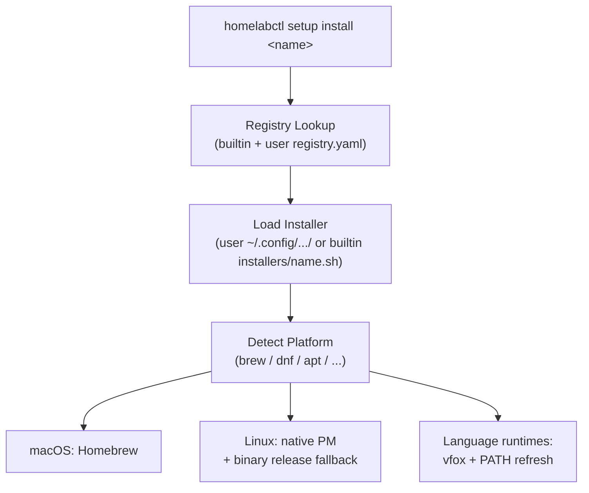

# Setup Guide

The `setup` command manages software installation across different platforms. It provides a unified interface for
installing CLI tools, programming languages, and DevOps tools.

## Table of Contents

- [Quick Start](#quick-start)
- [Commands](#commands)
- [Available Packages](#available-packages)
- [Package Dependencies](#package-dependencies)
- [Profiles](#profiles)
- [System Configuration](#system-configuration)
- [How It Works](#how-it-works)
- [User Extensions](#user-extensions)
- [Platform Support](#platform-support)

## Quick Start

```shell
# List available packages
homelabctl setup list
homelabctl setup list -c cli-tools
homelabctl setup list --installed

# Show package info and dependencies
homelabctl setup info fzf
homelabctl setup deps markdownlint-cli

# Install packages
homelabctl setup install fzf
homelabctl setup install nodejs -v 20
homelabctl setup install jdk -v 17

# Work with profiles
homelabctl setup profile list
homelabctl setup profile show recommend
homelabctl setup profile apply recommend --dry-run
homelabctl setup profile apply recommend --continue
```

## Commands

### Package Management

| Command                             | Description                     |
|-------------------------------------|---------------------------------|
| `setup list`                        | List available packages         |
| `setup list -c <category>`          | Filter by category              |
| `setup list --installed`            | Show only installed packages    |
| `setup list --categories`           | List available categories       |
| `setup info <name>`                 | Show package details            |
| `setup info <name> --all-platforms` | Show all platform-specific info |
| `setup deps <name>`                 | Show dependency tree            |
| `setup deps <name> --reverse`       | Show reverse dependencies       |
| `setup install <name>`              | Install a package               |
| `setup install <name> -v <version>` | Install specific version        |
| `setup install <name> --dry-run`    | Preview installation            |
| `setup install <name> --no-deps`    | Skip dependency installation    |

### Profile Management

| Command                                       | Description                 |
|-----------------------------------------------|-----------------------------|
| `setup profile list`                          | List available profiles     |
| `setup profile show <name>`                   | Show profile details        |
| `setup profile apply <name>`                  | Apply a profile             |
| `setup profile apply <name> --dry-run`        | Preview profile application |
| `setup profile apply <name> --continue`       | Continue on errors          |
| `setup profile apply <name> --skip-installed` | Skip already installed      |
| `setup profile apply <name> --no-deps`        | Skip dependencies           |

### System Configuration

| Command                      | Description                         |
|------------------------------|-------------------------------------|
| `setup configure list`       | List available configurations       |
| `setup configure chrony`     | Configure NTP time synchronization  |
| `setup configure expand-lvm` | Expand LVM partition and filesystem |
| `setup configure gpg-import` | Import GPG keys                     |
| `setup configure gpg-preset` | Preset GPG passphrase in gpg-agent  |
| `setup configure yadm`       | Clone dotfiles repository           |

## Available Packages

Packages are organized into categories. Use `homelabctl setup list --categories` to see all categories.

### system - System Prerequisites

| Package    | Description                           |
|------------|---------------------------------------|
| homebrew   | The Missing Package Manager for macOS |
| gnu-getopt | GNU getopt for argument parsing       |

### shell - Shell and Terminal

| Package  | Description                              |
|----------|------------------------------------------|
| zsh      | Z shell                                  |
| tmux     | Terminal multiplexer                     |
| ohmyzsh  | Framework for managing zsh configuration |
| starship | Cross-shell prompt                       |
| zoxide   | Smarter cd command                       |

### editors - Text Editors

| Package | Description                       |
|---------|-----------------------------------|
| vim     | Vi IMproved                       |
| neovim  | Vim-fork focused on extensibility |

### languages - Programming Languages

| Package | Description                    |
|---------|--------------------------------|
| nodejs  | JavaScript runtime             |
| jdk     | Java Development Kit           |
| python  | Python programming language    |
| go      | Go programming language        |
| rust    | Rust programming language      |
| ruby    | Ruby programming language      |
| vfox    | Cross-platform version manager |
| mvn     | Apache Maven build tool        |

### devops - DevOps Tools

| Package       | Description                        |
|---------------|------------------------------------|
| kubectl       | Kubernetes CLI                     |
| helm          | Kubernetes package manager         |
| kubecm        | Kubernetes context manager         |
| vagrant       | Development environments made easy |
| docker        | Container platform                 |
| terraform     | Infrastructure as Code             |
| ansible       | IT automation platform             |

### vcs - Version Control

| Package                | Description                           |
|------------------------|---------------------------------------|
| git                    | Distributed version control           |
| lazygit                | Simple terminal UI for git            |
| tig                    | Text-mode interface for git           |
| git-credential-manager | Cross-platform Git credential storage |
| yadm                   | Yet Another Dotfiles Manager          |

### security - Security Tools

| Package  | Description                     |
|----------|---------------------------------|
| gpg      | GNU Privacy Guard               |
| pinentry | PIN or passphrase entry dialogs |
| pass     | Password store                  |

### search - Search Utilities

| Package            | Description                        |
|--------------------|------------------------------------|
| fzf                | Command-line fuzzy finder          |
| fzf-tab-completion | Fzf tab completion for bash/zsh    |
| fd                 | Simple, fast alternative to find   |
| ripgrep            | Fast grep alternative              |
| bat                | Cat clone with syntax highlighting |
| eza                | Modern ls replacement              |

### dev-tools - Development Tools

| Package          | Description                  |
|------------------|------------------------------|
| jq               | Lightweight JSON processor   |
| shellcheck       | Shell script static analysis |
| markdownlint-cli | Markdown linting tool        |

### utilities - System Utilities

| Package   | Description                     |
|-----------|---------------------------------|
| mc        | Midnight Commander file manager |
| fastfetch | System information tool         |

## Package Dependencies

Packages can declare three types of dependencies:

| Type         | Behavior                                              |
|--------------|-------------------------------------------------------|
| `requires`   | Required dependencies, auto-installed before target   |
| `recommends` | Optional recommendations, shown as hint after install |
| `conflicts`  | Mutually exclusive packages, blocks installation      |

### Built-in Dependencies

| Package                              | Requires        | Recommends        |
|--------------------------------------|-----------------|-------------------|
| markdownlint-cli                     | nodejs          | -                 |
| ohmyzsh                              | zsh             | -                 |
| fzf-tab-completion                   | fzf             | -                 |
| pass                                 | gpg             | -                 |
| git-credential-manager               | git             | pass, gpg (Linux) |
| git-credential-manager (linux-arm64) | git, dotnet-sdk | pass, gpg         |

### Dependency Resolution

```shell
# Install with dependencies (default)
homelabctl setup install markdownlint-cli --dry-run
# Output: nodejs, markdownlint-cli

# Skip dependencies
homelabctl setup install markdownlint-cli --no-deps --dry-run
# Output: markdownlint-cli only

# View dependency tree
homelabctl setup deps markdownlint-cli
# markdownlint-cli
# └── nodejs

# View reverse dependencies
homelabctl setup deps nodejs --reverse
# nodejs
# └── markdownlint-cli
```

## Profiles

Profiles define a set of packages to install together.

### Built-in Profiles

| Profile     | Description                                         |
|-------------|-----------------------------------------------------|
| `recommend` | Recommended development environment with essentials |

### Using Profiles

```shell
# List profiles
homelabctl setup profile list

# Show profile details
homelabctl setup profile show recommend

# Preview application
homelabctl setup profile apply recommend --dry-run

# Apply profile
homelabctl setup profile apply recommend

# Continue on errors
homelabctl setup profile apply recommend --continue
```

## System Configuration

The `setup configure` commands provide ready-to-use system configuration tasks.

| Command      | Description                         | Options                                                             |
|--------------|-------------------------------------|---------------------------------------------------------------------|
| `chrony`     | Configure NTP time synchronization  | `--servers`, `--timezone`                                           |
| `expand-lvm` | Expand LVM partition and filesystem | `--partition`, `--vg`, `--lv`                                       |
| `gpg-import` | Import GPG keys                     | `--secret-key-file`, `--passphrase-file`, `--key-id`, `--keyserver` |
| `gpg-preset` | Preset GPG passphrase               | `--key-uid`, `--passphrase-file`                                    |
| `yadm`       | Clone dotfiles repository           | `--repo-url`, `--ssh-key-file`, `--bootstrap`                       |

All commands support `--dry-run` to preview changes.

### Examples

```shell
# Configure time synchronization
homelabctl setup configure chrony --servers "ntp.aliyun.com" --timezone "Asia/Shanghai"

# Expand LVM (auto-detects configuration)
homelabctl setup configure expand-lvm

# Import GPG keys
homelabctl setup configure gpg-import --secret-key-file ~/.secrets/key.asc --passphrase-file ~/.secrets/pass.txt

# Preset GPG passphrase for automation
homelabctl setup configure gpg-preset --key-uid "user@example.com" --passphrase-file ~/.secrets/pass.txt

# Clone dotfiles with yadm
homelabctl setup configure yadm --repo-url "git@github.com:user/dotfiles.git" --ssh-key-file ~/.ssh/id_rsa --bootstrap
```

## How It Works



### Architecture

The install system uses a layered architecture:

1. **Registry** (`registry.yaml`) - Defines available packages and metadata
2. **Installer Loader** (`installer.sh`) - Dynamically sources per-package scripts
3. **Installers** (`installers/<name>.sh`) - Implements platform-specific install strategies

### Install Strategy Priority

1. **Version manager** (vfox) - For language runtimes (nodejs, jdk, ruby, go, python)
2. **Native package manager** - brew on macOS, dnf/apt on Linux
3. **Binary release fallback** - Download from GitHub Releases / official CDN
4. **Source build** - Last resort for tools without pre-built binaries

For language runtimes, [vfox](https://github.com/version-fox/vfox) is preferred when available. After a vfox-based
install, the current shell PATH is refreshed via `vfox env` so dependent tools (e.g., markdownlint-cli needs npm) can be
installed in the same session.

## User Extensions

Users can extend the setup feature by adding custom packages and profiles in `~/.config/homelabctl/setup/`:

```
~/.config/homelabctl/setup/
├── registry.yaml      # Custom package definitions
├── profiles/          # Custom profiles
│   └── my-profile.yaml
└── installers/        # Custom installers
    └── my-tool.sh
```

User files take precedence over builtin files when names conflict.

### Adding a Custom Package

1. Define in `~/.config/homelabctl/setup/registry.yaml`:

```yaml
packages:
  my-tool:
    desc: "My custom tool"
    category: utilities
    check-cmd: my-tool         # Command to verify installation
    homepage: https://example.com
    requires: git              # Dependencies (auto-installed)
    recommends: fzf            # Optional recommendations (shown as hint)
    platform: # Platform-specific dependencies
      linux:
        recommends: pass gpg
      linux-arm64: # OS-arch specific (higher priority than OS-only)
        requires: dotnet-sdk
        recommends: pass gpg
```

Platform keys support both OS-only (`linux`, `darwin`) and OS-arch combinations (`linux-arm64`, `darwin-amd64`). The
lookup chain is: `os-arch` → `os` → base.

2. Create installer at `~/.config/homelabctl/setup/installers/my-tool.sh`:

```bash
#!/usr/bin/env bash
_setup_install_my_tool() {
  local version="${1:-latest}"
  local pm
  pm=$(radp_os_get_distro_pm 2>/dev/null || echo "unknown")

  case "$pm" in
  brew) brew install my-tool ;;
  dnf) sudo dnf install -y my-tool ;;
  apt) sudo apt-get install -y my-tool ;;
  *)
    radp_log_error "Unsupported platform"
    return 1
    ;;
  esac
}
```

### Adding a Custom Profile

Create `~/.config/homelabctl/setup/profiles/my-profile.yaml`:

```yaml
name: my-profile
desc: "My custom profile"
platform: any              # any, darwin, linux

packages:
  - name: fzf
  - name: bat
  - name: my-tool
    version: "1.0.0"       # Optional: specific version
```

Then apply: `homelabctl setup profile apply my-profile`

To create a profile that inherits from a builtin profile and adds extra packages:

```yaml
# ~/.config/homelabctl/setup/profiles/my-dev.yaml
name: my-dev
desc: "Extended development profile"
extends: recommend
platform: any

packages:
  - name: docker
  - name: terraform
  - name: nodejs
    version: "22"          # Override version from parent
```

### Registry YAML Schema

```yaml
packages:
  <package-name>:
    # Required fields
    desc: <string>                   # Short description
    category: <category-name>        # Must match a defined category

    # Optional fields
    check-cmd: <command>             # Command to check if installed (default: package name)
    homepage: <url>                  # Project homepage URL

    # Dependency fields (space-separated package names)
    requires: <pkg1> <pkg2>          # Required dependencies, auto-installed
    recommends: <pkg1> <pkg2>        # Recommended packages, shown as hint
    conflicts: <pkg1> <pkg2>         # Mutually exclusive packages

    # Platform-specific dependencies
    platform:
      linux:
        requires: <pkg>              # Appended to base
        recommends: <pkg>
      linux-arm64:
        requires: <pkg>              # Overrides linux key
      darwin:
        recommends: "!pkg"           # "!" prefix replaces base

categories:
  <category-name>:
    desc: <string>                   # Category description
```

**Platform Merge Rules:**

| Platform Value | Behavior        |
|----------------|-----------------|
| `pkg1 pkg2`    | Appends to base |
| `!pkg1 pkg2`   | Replaces base   |
| `!`            | Clears (empty)  |

### Profile YAML Schema

```yaml
name: <profile-name>                 # Profile identifier
desc: <string>                       # Profile description
extends: <parent-profile-name>       # Optional: inherit packages from parent
platform: any                        # any, linux, darwin

packages:
  - name: <package-name>             # Package from registry
    version: "<version>"             # Optional: specific version
```

## Platform Support

### macOS

- Uses Homebrew as primary package manager
- Supports both Intel (x86_64) and Apple Silicon (arm64)
- Some tools fall back to binary releases from GitHub

### Linux

- **Fedora/RHEL/CentOS**: DNF/YUM with binary release fallback
- **Ubuntu/Debian**: APT with binary release fallback
- **Other distros**: Binary releases from GitHub or official install scripts

### ARM64 Notes

Some packages have special handling on ARM64:

| Package                | ARM64 Behavior                           |
|------------------------|------------------------------------------|
| git-credential-manager | Requires dotnet-sdk (no prebuilt binary) |
| Various tools          | May fall back to source build            |

Use `homelabctl setup info <name> --all-platforms` to see platform-specific details.
